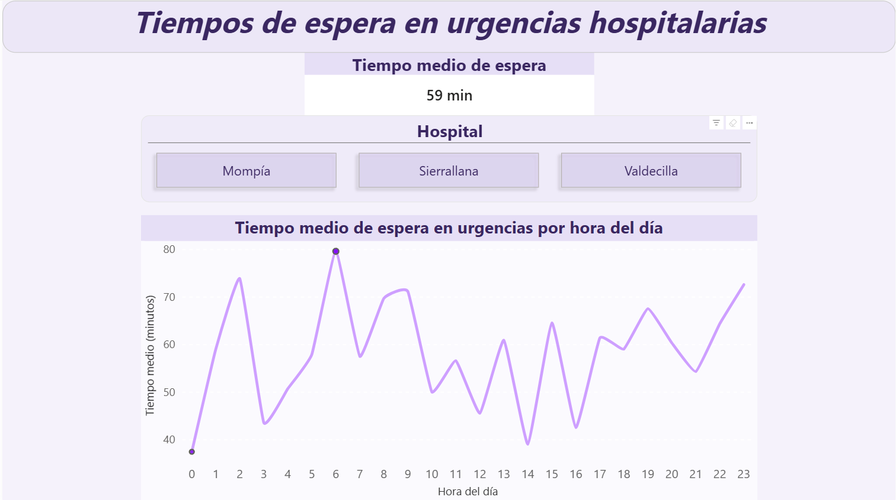

# 📊 Tiempos de espera en urgencias hospitalarias

Este proyecto analiza los tiempos de espera en servicios de urgencias hospitalarias, utilizando datos simulados basados en tres hospitales de referencia en Cantabria: Valdecilla, Sierrallana y Mompía.

El objetivo es identificar patrones de saturación y explorar posibles ineficiencias en la gestión de recursos sanitarios.

---

## 🎯 Objetivo

Analizar cómo varían los tiempos de espera a lo largo del día y evaluar si factores como la distribución de turnos del personal sanitario pueden estar influyendo en la eficiencia del servicio.

---

## 📊 Dashboard interactivo

Puedes explorar el dashboard aquí:

👉 [AÑADIR LINK POWER BI]

---

## 📽️ Demo

En la carpeta `media/` se incluye un vídeo mostrando el funcionamiento del dashboard.

---

## 📊 Principales insights

- El tiempo medio de espera se sitúa en torno a **60 minutos**
- Existen **picos claros de saturación** en determinadas franjas horarias
- La saturación parece ser un problema **estructural más que puntual**
- Los tiempos de espera son similares entre hospitales, lo que sugiere un problema generalizado

---

## 🧾 Proceso del proyecto

El desarrollo del proyecto ha seguido un flujo completo de análisis de datos:

### 1. Creación del dataset
- Generación de datos simulados en Excel
- Representación de pacientes, hospitales, tiempos de espera y personal sanitario

### 2. Limpieza de datos
- Eliminación de valores nulos en variables clave
- Estandarización de texto (`ESPACIOS` y `LIMPIAR`)
- Preparación del dataset para análisis

### 3. Análisis exploratorio (EDA)
- Cálculo del tiempo medio de espera
- Identificación de patrones por hora del día
- Detección de horas pico de saturación

### 4. Visualización
- Desarrollo de dashboard en Power BI
- KPI principal (tiempo medio de espera)
- Gráfico de líneas por hora
- Filtro interactivo por hospital

📄 Detalle completo del proceso:
👉 `docs/project_workflow.md`

---

## 📁 Estructura del repositorio
data/
├── raw/ → dataset original sin limpiar
└── clean/ → dataset preparado para análisis

docs/
└── project_workflow.md

images/
└── capturas del dashboard

media/
└── vídeo demostración

powerbi/
└── dashboard.pbix

---

## 📂 Dataset

Se incluye el dataset original sin limpiar en:

data/raw/dataset_hospital_raw.csv

Esto permite reproducir todo el proceso de limpieza y análisis desde cero.

---

## ⚠️ Nota

Los datos utilizados son simulados y tienen fines exclusivamente educativos.

---

## 🛠️ Tecnologías utilizadas

- Excel  
- Power BI  
- DAX  

---

## 🧠 Conclusión

El análisis sugiere que los tiempos de espera no dependen únicamente del hospital, sino que pueden estar relacionados con la organización interna del servicio.

👉 Una posible línea de mejora sería la optimización de los turnos del personal sanitario para reducir la saturación en horas críticas.

---

## 👩‍💻 Autor

Proyecto desarrollado por Ana Moya como parte de su formación en análisis de datos.
